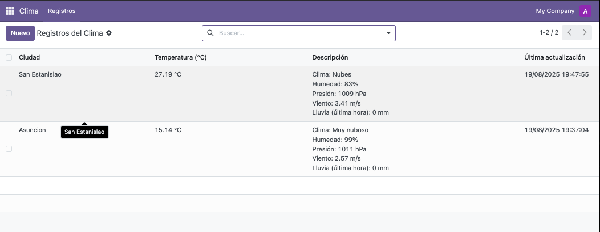
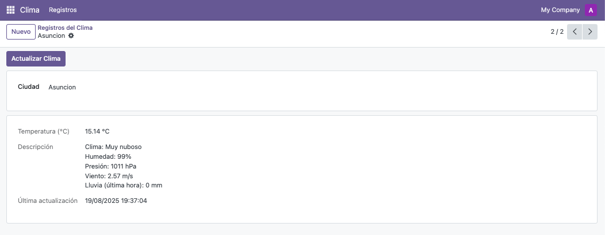

# Weather Dashboard - Odoo 18

*weather_dashboard* es un módulo para **Odoo 18** que permite consultar, registrar y visualizar la información del clima de cualquier ciudad usando la **API de OpenWeatherMap**. Ideal para mostrar cómo integrar Odoo con APIs externas y crear dashboards simples pero efectivos.

## Características
- Consultar el clima de cualquier ciudad.
- Registrar automáticamente temperatura, descripción y fecha.
- Visualizar el historial de temperaturas en un listado.
- Compatible con Odoo 18.
- Fácil instalación y configuración.

## Instalación
1. Clonar el repositorio en la carpeta 'addons' de tu Odoo:
```bash
   git clone https://github.com/lichagm/odoo-weather-dashboard.git
```
2. Instalar dependencias de Python:
```bash
    pip install -r requirements.txt
```
3. Crea un archivo .env en la raíz del módulo con el siguiente contenido:
API_WEATHER_KEY=tu_api_key_aqui

Ejemplo:


4. Actualizar la lista de aplicaciones en Odoo y buscar *weather_dashboard* para instalarlo.

## Vistas del módulo

Vista tipo lista:



Vista tipo formulario:



